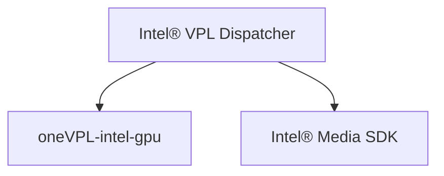

# Build/Install Intel® Video Processing Library (Intel® VPL) from Source

This document describes how to build from the source code in this repo.  Please
note: this repo contains only headers, dispatcher, examples.  In most cases an
implementation must also be installed.

## Basic build and install with CMake

The following commands will build the project and install it locally in
`_vplinstall`. Note that the bootstrap script will install dependencies needed
to build the project.

Linux:

```
git clone https://github.com/intel/libvpl
cd libvpl
export VPL_INSTALL_DIR=`pwd`/../_vplinstall
sudo script/bootstrap
cmake -B _build -DCMAKE_INSTALL_PREFIX=$VPL_INSTALL_DIR
cmake --build _build
cmake --install _build
```


Windows cmd prompt:
```
git clone https://github.com/intel/libvpl
cd libvpl
set VPL_INSTALL_DIR=%cd%\..\_vplinstall
script\bootstrap.bat
cmake -B _build -DCMAKE_INSTALL_PREFIX=%VPL_INSTALL_DIR%
cmake --build _build --config Release
cmake --install _build --config Release
```
> **Note:** bootstrap.bat requires [WinGet](https://github.com/microsoft/winget-cli)


## Getting an Implementation

The base package is limited to the dispatcher and samples. To use Intel® VPL for
video processing you need to install at least one implementation. Current
implementations:

- [oneVPL-intel-gpu](https://github.com/intel/vpl-gpu-rt) for use on
  Intel Xe graphics and newer
- [Intel® Media SDK](https://github.com/Intel-Media-SDK/MediaSDK) for use on legacy
  Intel graphics

Follow the instructions on the respective repos to install the desired
implementation

Remember, applications link to dispatcher and dispatcher forwards function calls
to the selected implementation.


