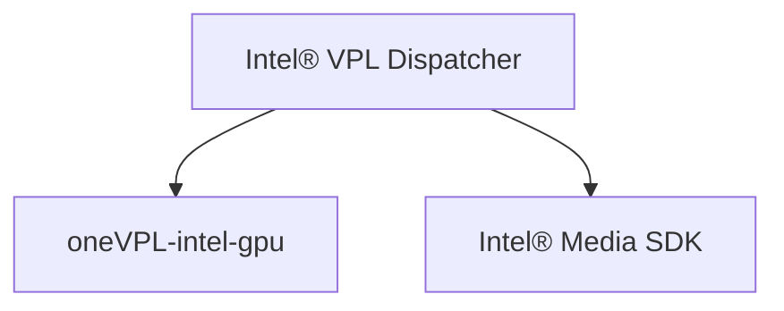

# Build/Install Intel® Video Processing Library (Intel® VPL) from Source

This document describes how to build from the source code in this repo.  Please
note: this repo contains only headers, dispatcher, examples, and tools.  In most
cases an implementation must also be installed.

## Quick Start

This repository includes convenience scripts to get prerequisites, build, and
install the software.

Linux:

```
cd <vpl-repo-clone-location>
sudo script/bootstrap
script/build
sudo script/install
```


Windows DOS cmd prompt:
```
cd <vpl-repo-clone-location>
script\bootstrap.bat
script\build.bat
script\install.bat
```
> **Note:** bootstrap.bat requires [WinGet](https://github.com/microsoft/winget-cli)

Additional helper scripts are available in the script folder. For more details
see [script/README.md](script/README.md)


## Getting an Implementation

The base package is limited to the dispatcher and samples. To use Intel® VPL for
video processing you need to install at least one implementation. Current
implementations:

- [oneVPL-intel-gpu](https://github.com/intel/libvpl-intel-gpu) for use on
  Intel Xe graphics and newer
- [Intel® Media SDK](https://github.com/Intel-Media-SDK/MediaSDK) for use on legacy
  Intel graphics

Follow the instructions on the respective repos to install the desired
implementation

Remember, applications link to dispatcher and dispatcher forwards function calls
to the selected implementation.




## Using Intel® VPL

### Configure your shell environment

If you did not install to standard system locations, you need to set up the
environment, so tools like CMake and pkg-config can find the library and
headers.

For Linux:
```
source <vpl-install-location>/etc/vpl/vars.sh
```

For Windows:
```
<vpl-install-location>\etc\vpl\vars.bat
```

### Link to Intel® VPL with CMake

Add the following code to your CMakeLists, assuming TARGET is defined as the
component that wants to use Intel® VPL:

```
if(WIN32 AND CMAKE_SIZEOF_VOID_P EQUAL 4)
 set(CMAKE_LIBRARY_ARCHITECTURE x86)
endif()
find_package(VPL REQUIRED)
target_link_libraries(${TARGET} VPL::dispatcher)
```


### Link to Intel® VPL from Bash with pkg-config

The following command line illustrates how to link a simple program to Intel® VPL
using pkg-config.

```
gcc program.cpp `pkg-config --cflags --libs vpl`
```

## Additional build options

You can also build the project directly with CMake for more control over the
build.

### Recommended Prerequisites

The following recommendations represent tools used regularly for testing,
not the absolute minimum versions that can be made to work.

To build this project you will need:

- A compiler with C++11 support
- CMake 3.22.1 or newer

On Windows, you will also need:

- Visual Studio Build Tools 2019
	* Visual C++ ATL for x86 and x64
- Visual Studio 2019
	* C++ ATL for latest 'X' build tools (x86 & x64)

To enable full capabilities of tools on Linux the following packages must be discoverable via pkg-config:
<pre>
libva >= 1.2
libva -drm >= 1.2
libdrm >= 2.4.91
pciaccess
x11
libca-x11 >= 1.10.0
wayland-client
libwayland
wayland-protocols >= 1.15
</pre>

Example for Ubuntu 20.04
<pre>
apt install libva-dev libdrm-dev wayland-protocols libx11-dev libx11-xcb-dev libxcb-present-dev libxcb-dri3-dev
</pre>
Install the equivalent packages for other distributions

### Basic build and install with CMake

Build the project with the following commands:

Linux:
```
cd <vpl-repo-clone-location>
export VPL_INSTALL_DIR=`pwd`/../_vplinstall
mkdir _build
mkdir $VPL_INSTALL_DIR
cd _build
cmake .. -DCMAKE_INSTALL_PREFIX=$VPL_INSTALL_DIR
cmake --build . --config Release
cmake --build . --config Release --target install
```

Windows DOS cmd prompt:
```
cd <vpl-repo-clone-location>
set VPL_INSTALL_DIR=%cd%\..\_vplinstall
mkdir _build
mkdir %VPL_INSTALL_DIR%
cd _build
cmake .. -DCMAKE_INSTALL_PREFIX=%VPL_INSTALL_DIR%
cmake --build . --config Release
cmake --build . --config Release --target install
```

You can find the build output in the location chosen for CMAKE_INSTALL_PREFIX, VPL_INSTALL_DIR.

### Debug build target

Build the project with the following commands:

Linux:
```
cd <vpl-repo-clone-location>
export VPL_INSTALL_DIR=`pwd`/../_vplinstall
mkdir _build
mkdir $VPL_INSTALL_DIR
cd _build
cmake .. -DCMAKE_INSTALL_PREFIX=$VPL_INSTALL_DIR -DCMAKE_BUILD_TYPE=Debug
cmake --build . --config Debug
cmake --build . --config Debug --target install
```

Windows:
```
cd <vpl-repo-clone-location>
set VPL_INSTALL_DIR=%cd%\..\_vplinstall
mkdir _build
mkdir %VPL_INSTALL_DIR%
cd _build
cmake .. -DCMAKE_INSTALL_PREFIX=%VPL_INSTALL_DIR%
cmake --build . --config Debug
cmake --build . --config Debug --target install
```
