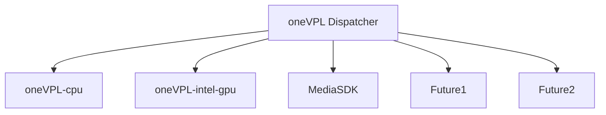

#  Video Processing Library

The oneAPI Video Processing Library (oneVPL) is a programming interface for video decoding, encoding, 
and processing to build portable media pipelines on CPUs, GPUs, and other accelerators.

It provides device discovery
and selection in media centric and video analytics workloads and API primitives for zero-copy buffer sharing. oneVPL is backwards
and cross-architecture compatible to ensure optimal execution on current and next generation hardware without source code changes.

See the [oneVPL Specification](https://spec.oneapi.io/versions/latest/elements/oneVPL/source/index.html) for additional information. This is part of the [oneAPI specification](https://www.oneapi.io/spec/).

This repository contains the following components of oneVPL:

- Copies of the oneVPL Specification API header files. The version of the oneVPL API is listed in the
[mfxdefs.h](./api/vpl/mfxdefs.h) file.
- oneVPL dispatcher
- Examples demonstrating API usage
- oneVPL command line tools

To use oneVPL for video processing you need to install at least one implementation. Here is a list of current implementations.

- [oneVPL-cpu](https://github.com/oneapi-src/oneVPL-cpu) for use on CPU
- [oneVPL-intel-gpu](https://github.com/oneapi-src/oneVPL-intel-gpu) for use on Intel Xe graphics and newer
- [Media SDK](https://github.com/Intel-Media-SDK/MediaSDK) for use on legacy Intel graphics

## OneVPL Architecture


As shown in this diagram, the dispatcher dispatches the application to use either the VPL CPU runtime, VPL GPU runtime, or the MediaSDK GPU Runtime. We may support more implementations in the future.

## oneVPL dispatcher behavior when targeting Intel GPUs
Runtime loaded by oneVPL dispatcher:


| GPU                                        | Media SDK        | oneVPL           |
|--------------------------------------------|------------------|------------------|
| Earlier platforms, back to BDW (Broadwell) |:heavy_check_mark:|                  |
| ICL (Ice Lake)                             |:heavy_check_mark:|                  |
| JSL (Jasper Lake)                          |:heavy_check_mark:|                  |
| EHL (Elkhart Lake)                         |:heavy_check_mark:|                  |
| SG1                                        |:heavy_check_mark:|                  |
| TGL (Tiger Lake)                           |                  |:heavy_check_mark:|
| DG1 (Iris® Xe MAX)                         |                  |:heavy_check_mark:|
| RKL (Rocket Lake)                          |                  |:heavy_check_mark:|
| ADL-S (Alder Lake S)                       |                  |:heavy_check_mark:|
| ADL-P (Alder Lake P)                       |                  |:heavy_check_mark:|
| Future platforms...                        |                  |:heavy_check_mark:|


## Installation

You can install oneVPL:

- from [oneVPL home page](https://software.intel.com/content/www/us/en/develop/tools/oneapi/components/onevpl.html) as a part of Intel&reg; oneAPI Base Toolkit.
- from source code.  See [Installation from Sources](INSTALL.md) for details.

For more details on installation options and procedures, see the [Intel® oneAPI Video Processing Library Installation Guide](https://software.intel.com/content/www/us/en/develop/articles/onevpl-installation-guide.html).

## Developer Usage

### Configure the Environment

If you did not install to standard system locations, you need to set up the
environment, so tools like CMake and pkg-config can find the library and
headers.

For Linux:
```
source <vpl-install-location>/etc/vpl/vars.sh
```

For Windows:
```
<vpl-install-location>\etc\vpl\vars.bat
```

### Link to oneVPL with CMake

Add the following code to your CMakeLists, assuming TARGET is defined as the
component that wants to use oneVPL:

```
if(WIN32 AND CMAKE_SIZEOF_VOID_P EQUAL 4)
 set(CMAKE_LIBRARY_ARCHITECTURE x86)
endif()
find_package(VPL REQUIRED)
target_link_libraries(${TARGET} VPL::dispatcher)
```


### Link to oneVPL from Bash with pkg-config

The following command line illustrates how to link a simple program to oneVPL
using pkg-config.

```
gcc program.cpp `pkg-config --cflags --libs vpl`
```


## Contributing

See [CONTRIBUTING.md](CONTRIBUTING.md) for more information.

## License

This project is licensed under the MIT License. See the [LICENSE](LICENSE) file
for details.

## Security

See the [Intel Security Center](https://www.intel.com/content/www/us/en/security-center/default.html) for information on how to report a potential
security issue or vulnerability.
