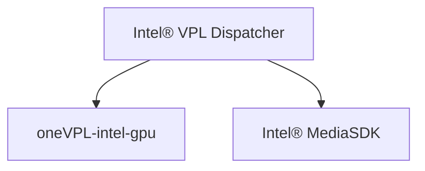

# Intel® Video Processing Library (Intel® VPL)

Intel® Video Processing Library (Intel® VPL) supports AI visual inference, media delivery, 
cloud gaming, and virtual desktop infrastructure use cases by providing access to hardware 
accelerated video decode, encode, and frame processing capabilities on Intel® GPUs.  

See the [specification](https://intel.github.io/libvpl) for additional information.

This repository contains the following components:

- Copies of the Intel® VPL API header files. The version of the API is listed in the
[mfxdefs.h](./api/vpl/mfxdefs.h) file.
- Intel® VPL Dispatcher
- Examples demonstrating API usage
- Command line tools
To use Intel® VPL for video processing you need to install at least one implementation. Here is a list:

- [oneVPL-intel-gpu](https://github.com/oneapi-src/oneVPL-intel-gpu) for use on Intel® Iris® Xe graphics and newer
- [Intel® Media SDK](https://github.com/Intel-Media-SDK/MediaSDK) for use on legacy Intel® graphics

## Architecture

As shown in this diagram, the Intel® VPL Dispatcher forwards function calls from the application to use the selected runtime.

## Dispatcher behavior when targeting Intel® GPUs
Runtime loaded by Intel® VPL Dispatcher and their Microsoft* DirectX* support:

| GPU                                        | Media SDK        | Intel® VPL           | Microsoft* DirectX* Support |
|--------------------------------------------|------------------|------------------|-----------------------------|
| Earlier platforms, back to BDW (Broadwell) |:heavy_check_mark:|                  | DX9/DX11                    |
| ICL (Ice Lake)                             |:heavy_check_mark:|                  | DX9/DX11                    |
| JSL (Jasper Lake)                          |:heavy_check_mark:|                  | DX9/DX11                    |
| EHL (Elkhart Lake)                         |:heavy_check_mark:|                  | DX9/DX11                    |
| SG1                                        |:heavy_check_mark:|                  | DX9/DX11                    |
| TGL (Tiger Lake)                           |:heavy_check_mark:|:heavy_check_mark:| DX9/DX11*                   |
| DG1 (Intel® Iris® Xe MAX graphics)         |:heavy_check_mark:|:heavy_check_mark:| DX11*                       |
| RKL (Rocket Lake)                          |                  |:heavy_check_mark:| DX11                        |
| ADL-S (Alder Lake S)                       |                  |:heavy_check_mark:| DX11                        |
| ADL-P (Alder Lake P)                       |                  |:heavy_check_mark:| DX11                        |
| DG2 (Intel® Arc™ A-Series Graphics)        |                  |:heavy_check_mark:| DX11                        |
| ATSM (Intel® Data Center GPU Flex Series)  |                  |:heavy_check_mark:| DX11                        |
| Future platforms...                        |                  |:heavy_check_mark:| DX11                        |

For TGL and DG1, if both Intel® VPL and Intel® Media SDK runtime are installed then the Intel® VPL Dispatcher will prefer Intel® VPL runtime unless the application requests D3D9 by setting the filter property "mfxImplDescription.AccelerationMode" to MFX_ACCEL_MODE_VIA_D3D9.

## Installation and Usage

### Installation options

Intel® VPL may be installed:

- from source code.  See install and use instructions at [INSTALL.md](INSTALL.md).
- from Linux packages.  See [Intel® software for general purpose GPU capabilities](https://dgpu-docs.intel.com/)

## How to Contribute

See [CONTRIBUTING.md](CONTRIBUTING.md) for more information.

## License

This project is licensed under the MIT License. See the [LICENSE](LICENSE) file
for details.

## Security

See the [Intel® Security Center](https://www.intel.com/content/www/us/en/security-center/default.html) for information on how to report a potential
security issue or vulnerability.
