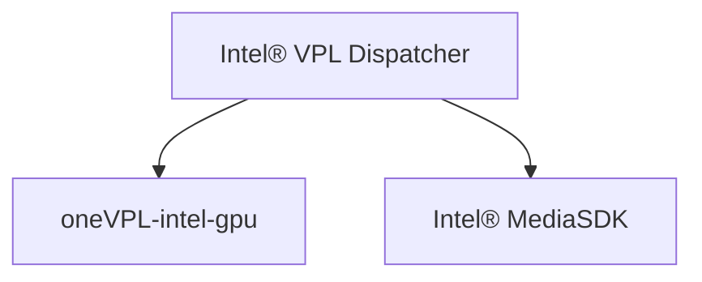

# Intel® Video Processing Library (Intel® VPL)

Intel® Video Processing Library (Intel® VPL) provides access to hardware
accelerated video decode, encode, and processing capabilities on Intel®
GPUs to support AI visual inference, media delivery, cloud gaming, and virtual
desktop infrastructure use cases.

See the [specification](https://intel.github.io/libvpl) for additional information.

This repository contains the following components:

- Copies of the Intel® VPL API header files. The version of the API is listed in
the [mfxdefs.h](./api/vpl/mfxdefs.h) file.
- Intel® VPL Dispatcher
- Examples demonstrating API usage

> [!IMPORTANT]
>
> Intel® VPL Tools are no longer in this repository. They have all been moved to
> https://github.com/intel/libvpl-tools

To use Intel® VPL for video processing you need to install at least one
implementation. Here is a list:

- [Intel® VPL GPU Runtime](https://github.com/intel/vpl-gpu-rt) for use on
  Intel® Iris® Xe graphics and newer
- [Intel® Media SDK](https://github.com/Intel-Media-SDK/MediaSDK) for use on
  legacy Intel® graphics

## Architecture


As shown in this diagram, the Intel® VPL Dispatcher forwards function calls from
the application to use the selected runtime.

## Dispatcher behavior when targeting Intel® GPUs
Runtime loaded by Intel® VPL Dispatcher and their Microsoft* DirectX* support:


| GPU                                        | Media SDK        | Intel® VPL       | Microsoft* DirectX* Support |
|--------------------------------------------|------------------|------------------|-----------------------------|
| Earlier platforms, back to BDW (Broadwell) |:heavy_check_mark:|                  | DX9/DX11                    |
| ICL (Ice Lake)                             |:heavy_check_mark:|                  | DX9/DX11                    |
| JSL (Jasper Lake)                          |:heavy_check_mark:|                  | DX9/DX11                    |
| EHL (Elkhart Lake)                         |:heavy_check_mark:|                  | DX9/DX11                    |
| SG1                                        |:heavy_check_mark:|                  | DX9/DX11                    |
| TGL (Tiger Lake)                           |:heavy_check_mark:|:heavy_check_mark:| DX9/DX11*                   |
| DG1 (Intel® Iris® Xe MAX graphics)         |:heavy_check_mark:|:heavy_check_mark:| DX11*                       |
| RKL (Rocket Lake)                          |                  |:heavy_check_mark:| DX11                        |
| ADL-S (Alder Lake S)                       |                  |:heavy_check_mark:| DX11                        |
| ADL-P (Alder Lake P)                       |                  |:heavy_check_mark:| DX11                        |
| ADL-N (Alder Lake N)                       |                  |:heavy_check_mark:| DX11                        |
| DG2 (Intel® Arc™ A-Series Graphics)        |                  |:heavy_check_mark:| DX11                        |
| ATSM (Intel® Data Center GPU Flex Series)  |                  |:heavy_check_mark:| DX11                        |
| RPL-S (Raptor Lake S)                      |                  |:heavy_check_mark:| DX11                        |
| RPL-P (Raptor Lake P)                      |                  |:heavy_check_mark:| DX11                        |
| MTL (Meteor Lake)                          |                  |:heavy_check_mark:| DX11                        |
| ARL-S (Arrow Lake S)                       |                  |:heavy_check_mark:| DX11                        |
| ARL-H (Arrow Lake H)                       |                  |:heavy_check_mark:| DX11                        |
| LNL (Lunar Lake)                           |                  |:heavy_check_mark:| DX11                        |
| Future platforms...                        |                  |:heavy_check_mark:| DX11                        |

For TGL and DG1, if both Intel® VPL and Intel® Media SDK runtime are installed
then the Intel® VPL Dispatcher will prefer Intel® VPL runtime unless the
application requests D3D9 by setting the filter property
"mfxImplDescription.AccelerationMode" to MFX_ACCEL_MODE_VIA_D3D9.

## Installing Intel® VPL

### Installation options

Intel® VPL may be installed:

- from source code.  See install and use instructions at
  [INSTALL.md](INSTALL.md).
- from Linux packages.  See [Intel® software for general purpose GPU
  capabilities](https://dgpu-docs.intel.com/)


## Using Intel® VPL

### Configure your shell environment

If you did not install to standard system locations, you need to set up the
environment, so tools like CMake and pkg-config can find the library and
headers.

For Linux:
```
source <vpl-install-location>/etc/vpl/vars.sh
```

For Windows:
```
<vpl-install-location>\etc\vpl\vars.bat
```

### Link to Intel® VPL with CMake

Add the following code to your CMakeLists, assuming TARGET is defined as the
component that wants to use Intel® VPL:

```
if(WIN32 AND CMAKE_SIZEOF_VOID_P EQUAL 4)
 set(CMAKE_LIBRARY_ARCHITECTURE x86)
endif()
find_package(VPL REQUIRED)
target_link_libraries(${TARGET} VPL::dispatcher)
```


### Link to Intel® VPL from Bash with pkg-config

The following command line illustrates how to link a simple program to Intel®
VPL using pkg-config.

```
gcc program.cpp `pkg-config --cflags --libs vpl`
```

## How to Contribute

See [CONTRIBUTING.md](CONTRIBUTING.md) for more information.

## License

This project is licensed under the MIT License. See the [LICENSE](LICENSE) file
for details.

## Security

See the [Intel® Security
Center](https://www.intel.com/content/www/us/en/security-center/default.html)
for information on how to report a potential security issue or vulnerability.
