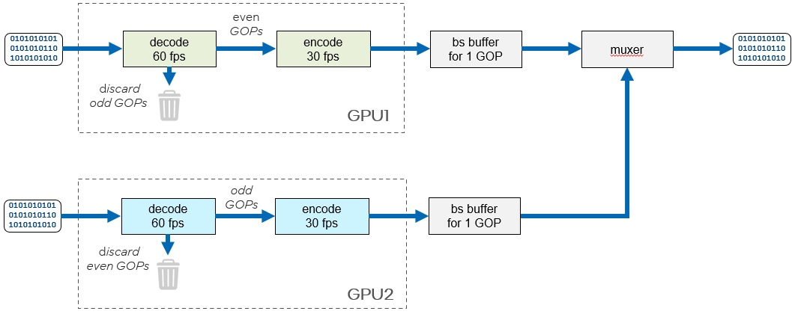
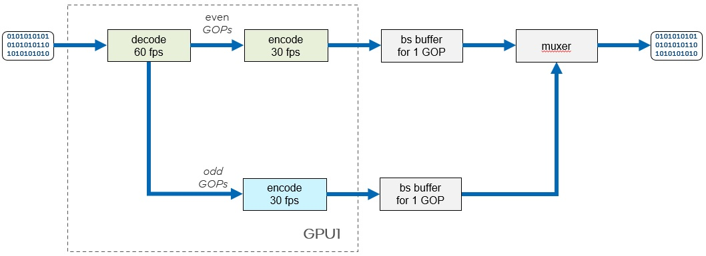

## Parallel encoding

Sometimes, e.g., for very high resolutions, transcoding couldn’t be handled by single decode / encode pair. For such use cases parallel transcoding has been developed. SMT supports two different parallel transcoding modes – so called 2x2, that distributes workload between different GPUs, and 1x2 that distributes workload between different HW units of the same GPU. In both cases parallelization is done on GOP level.


### 2x2 mode

Picture below shows pipeline configuration for 2x2 mode, numbers are for 60 fps transcoding case. This is the most powerful mode that can give up to 2x transcoding speed up. We use two GPUs here. Each one runs decode / encode pair. Because performance is usually limited by encoder, each GPU decodes all frames in input bitstream but encodes only half of them. That means that decoder runs at 60 fps, and encoder at 30 fps, reducing encoder workload twice in comparison to sequential transcoding. After two GOPs have been transcoded, we mux them back to single bitstream and write to file.


 

To run such pipeline, use this command line:
```
./sample_multi_transcode -par 2x2.par
```

and this par file:
```
-i::h265 in.h265 -device /dev/dri/renderD128 -async 30 -u 7 -dist 8 -gop_size 60 -idr_interval 1 -vbr -b 80000 -o::h265 res.h265  -parallel_encoding
-i::h265 in.h265 -device /dev/dri/renderD129 -async 30 -u 7 -dist 8 -gop_size 60 -idr_interval 1 -vbr -b 80000 -o::h265 null.h265
```

Note, that the only difference from conventional transcoding is presence of `-parallel_encoding` options in first line of par file.

Also note, that performance significantly depends on async depth value. It specifies buffer size between decoder and encoder. This buffer should be big enough to keep encoder busy while decoder skips irrelevant GOP. But at the same time, this buffer should be small enough not to cause local memory swapping, that will harm performance. This async depth value also impacts transcoding latency and sometimes it may be preferable to decrease this value and trade off performance for latency. Summing up, async depth can be used to tune performance / latency of parallel transcoding for different use cases. Good starting point is half of the GOP size.


### 1x2 mode

We use just one GPU here and performance gain comes from better distribution of workloads among available HW units of the same GPU. This mode gives much less performance gain in comparison to 2x2 mode. Depending on workload, it may be in 20-30% range. This mode uses one decoder that feeds two encoders. Each one encodes complete GOP. The rest of pipeline is similar to 2x2 mode.


 

To run such pipeline, use this command line:
```
./sample_multi_transcode -par 1x2.par
```

and this par file:
```
-i::h265 in.h265 -device /dev/dri/renderD128 -async 20 -o::sink -join -parallel_encoding
-i::source -join -async 20 -u 7 -dist 8 -gop_size 30 -idr_interval 1 -vbr -b 80000 -o::h265 res.h265
-i::source -join -async 20 -u 7 -dist 8 -gop_size 30 -idr_interval 1 -vbr -b 80000 -o::h265 null.h265
```

About async depth. Because everything runs on single GPU here, pressure on memory system is much higher in this mode and we recommend using smaller GOP sizes and bigger, relative to GOP size, async depth values. Good starting point is GOP 30 and async depth 20.

See also smt-tracer-readme.md for more details how to use SMT tracer to tune parallel encoding performance.
