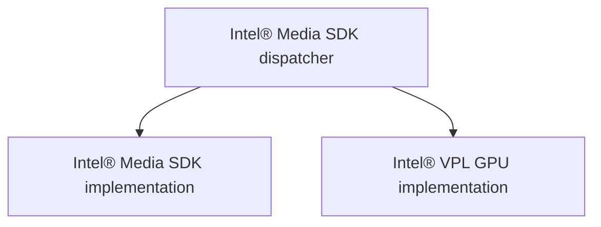
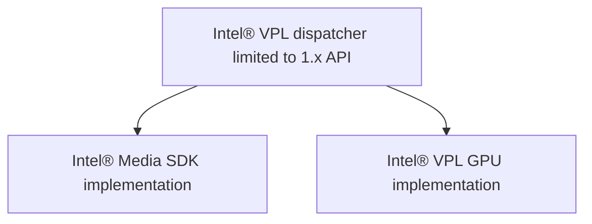
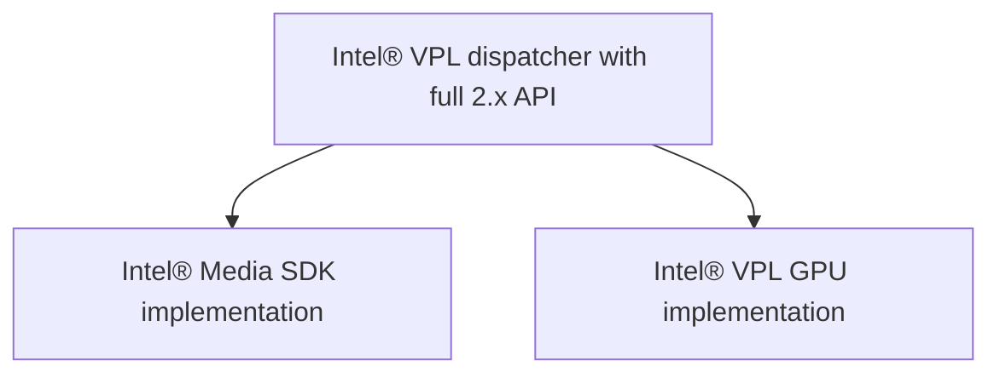

# Transition tutorial

## Purpose
This tutorial provides a working example demonstrating the steps to transition
applications from Intel® Media SDK to the Intel® Video Processing Library (Intel® VPL). 
Intel® VPL opens the door to many new features and improved support for
newer hardware.  However, use of those new features is not required. Code
without removed features that works for Intel® Media SDK will work for Intel® VPL.

After completing this tutorial you can apply the same process to transition
your applications.

This tutorial focuses on GPU only.  An Intel GPU is required to run the steps
below.

## License

MIT

## Prerequisites

To build this project you will need a system with these packages installed:
   - A compiler with C++11 support
   - [CMake](https://cmake.org) version 3.10 or newer
   - Intel® VPL and Intel® Media SDK

## Notes before starting

These instructions assume you can read and write to the location where
the examples are stored. If this is not the case (for example, if Intel® VPL has
been installed to "Program Files" in Windows) just copy the entire examples
folder to a location where you have read/write access and resume these
instructions from that copy.

Your shell should have paths etc. set up to find Intel® VPL.

For Windows, prepare your shell with:
```shell
<VPL_install_dir>\etc\vpl\vars.bat
```
Here `<VPL_install_dir>` represents the root folder of your Intel® VPL
installation from source. If you customized the installation
folder, the `<VPL_install_dir>/etc/vpl/vars.bat` is in your custom location.  Note that if a
compiler is not installed you should run in a Visual Studio 64-bit command prompt.

For Linux, prepare your shell with :
```shell
source <vpl_install_dir>/etc/vpl/vars.sh
```

## Tutorial Step 1

### Goal

The first step is a simple hello world from Intel® Media SDK.

This is the starting point for the tutorial sequence, representing
an Intel® Media SDK application which has not yet been transitioned to Intel® VPL.

Note that
1. Media Intel® SDK (mfx) includes are used in MediaSDK/CMakeLists.txt

```shell
target_include_directories(${TARGET} PUBLIC ${MFX_INCLUDE_DIRS})
```

2. Session initialization happens with 1.x API MFXInit:

```c++
    sts                = MFXInit(impl, &ver, &session);
```

Code compiled:
```c++
#include "mfxvideo.h"
#include <stdio.h>

int main() {
    mfxStatus sts = MFX_ERR_NONE;

    printf("Hello from Intel® Media SDK\n");
    mfxIMPL impl       = MFX_IMPL_HARDWARE;
    mfxVersion ver     = { 0, 1 };
    mfxSession session = {};
    sts                = MFXInit(impl, &ver, &session);
    printf("Intel® Media SDK 1.x MFXInit %s\n", (sts == MFX_ERR_NONE) ? "succeeded" : "failed");

    if (sts == MFX_ERR_NONE) {
        // Print info about implementation loaded
        mfxVersion version = { 0, 0 };
        MFXQueryVersion(session, &version);

        printf("Session loaded: ApiVersion = %d.%d \n", version.Major, version.Minor);

        // Clean up resources
        if (session)
            MFXClose(session);
    }
    else {
        printf("Initialization failed, please check system setup\n");
    }
    return 0;
}
```


In this scenario, the Intel® Media SDK dispatcher will route function calls from the
application to the implementation matching the hardware.  Even though the
dispatcher is limited to the Intel® Media SDK 1.35 API, it will load the Intel® VPL GPU
implementation for newer hardware platforms.



### Build:

Before starting the build steps on Windows, check that INTELMEDIASDKROOT
contains the install location for Intel® Media SDK.  Usually this is set when Intel® Media SDK
is installed.

```shell
cd MediaSDK
mkdir build
cd build
cmake ..
cmake --build . --config Release
```

### Run:
Linux:
```shell
./01_transition_mediasdk
```

Windows:
```shell
Release\01_transition_mediasdk
```

### Expected Results

The output shows that the Intel® Media SDK code path was executed.

```shell
Hello from Intel® Media SDK
Intel® Media SDK 1.x MFXInit succeeded
Session loaded: ApiVersion = 1.255
```

The reported API version is 1.255 here.  For purposes of application functionality
1.35 and 1.255 APIs are equivalent.

1.255 indicates that even though the implementation is capable of 2.x functionality
the application is limited to 1.x features since it was initialized with MFXInit
(the only session initialization option available in the 1.35 API).

If the media SDK implementation was loaded its API version will never
exceed 1.35.


## Tutorial Step 2

### Goal

The next step demonstrates how to transition to Intel® VPL with the most minimal
changes.  This uses the Intel® VPL dispatcher but, as with Intel® Media SDK, application
capabilities will be limited to 1.35.

Here
1. Intel® VPL paths to include files and libs are specified in VPL/CMakeLists.txt.
Application is linked to Intel® VPL dispatcher instead of Intel® Media SDK.

```shell
find_package(VPL REQUIRED)
target_link_libraries(${TARGET} VPL::dispatcher)
target_compile_definitions(${TARGET} PUBLIC -DUSE_VPL_INCLUDE)
```

2. Session initialization still happens with 1.x API MFXInit.  Beyond changing
includes to their Intel® VPL equivalents, *no additional code changes are required*
to start using Intel® VPL.

With this approach you will see a deprecation warning during compile.

```
warning C4996: 'MFXInit': was declared deprecated
```

Deprecated functions may be removed at a later date but no timeline is currently set.


Code is unchanged from the previous step, except "vpl/mfx.h"  is included
instead of "mfxvideo.h".

```c++
#include "vpl/mfx.h"
#include <stdio.h>

int main() {
    mfxStatus sts = MFX_ERR_NONE;

    printf("Hello from Intel® Media SDK\n");
    mfxIMPL impl       = MFX_IMPL_HARDWARE;
    mfxVersion ver     = { 0, 1 };
    mfxSession session = {};
    sts                = MFXInit(impl, &ver, &session);
    printf("Intel® Media SDK 1.x MFXInit %s\n", (sts == MFX_ERR_NONE) ? "succeeded" : "failed");

    if (sts == MFX_ERR_NONE) {
        // Print info about implementation loaded
        mfxVersion version = { 0, 0 };
        MFXQueryVersion(session, &version);

        printf("Session loaded: ApiVersion = %d.%d \n", version.Major, version.Minor);

        // Clean up resources
        if (session)
            MFXClose(session);
    }
    else {
        printf("Initialization failed, please check system setup\n");
    }
    return 0;
}
```

In this scenario, the Intel® VPL dispatcher will route function calls from the
application to the implementation instead of the Intel® Media SDK dispatcher.



### Build:


```shell
cd VPL
mkdir build
cd build
cmake ..
cmake --build . --config Release
```

### Run:
Linux:
```shell
./01_transition_vpl
```

Windows:
```shell
Release\01_transition_vpl
```

### Expected Results

The output shows that

```shell
Hello from Intel® Media SDK
Intel® Media SDK 1.x MFXInit succeeded
Session loaded: ApiVersion = 1.255
```

Application behavior is identical, even though dispatcher has been updated to
Intel® VPL.

1.255 indicates that even though the implementation is capable of 2.x functionality
the application is limited to 1.x API features since the session was initialized
with MFXInit.  The deprecation warning indicates that update to 2.x session
initialization is recommended to access full functionality.


## Tutorial Step 3

### Goal

The final step demonstrates the minor change needed to unlock the full range of
Intel® VPL capabilities.  Upgrading to 2.x API session initialization is recommended
but not required.

The new session initialization has many improvements designed
to help with writing applications for multiple adapters.  The 1.x MFXInit approach
was designed when only a single integrated graphics adapter was available.  In 2.x
there are a few more steps but they allow control needed where the application must
choose between many available implementations.

The code compiled here upgrades session initialization to minimal steps with API 2.x.

```c++
#include "vpl/mfx.h"
#include <stdio.h>

int main() {
    mfxStatus sts = MFX_ERR_NONE;

    // Create loader with a list of all available implementations
    mfxLoader loader = MFXLoad();

    // Create a config filter so that loader list only contains HW implementation
    mfxConfig cfg = MFXCreateConfig(loader);
    mfxVariant implValue;
    implValue.Type     = MFX_VARIANT_TYPE_U32;
    implValue.Data.U32 = MFX_IMPL_TYPE_HARDWARE;
    MFXSetConfigFilterProperty(cfg, (mfxU8 *)"mfxImplDescription.Impl", implValue);

    printf("Hello from unconstrained Intel® VPL\n");
    mfxSession session = {};
    sts                = MFXCreateSession(loader, 0, &session);
    printf("Intel® VPL 2.x API init MFXCreateSession %s\n",
           (sts == MFX_ERR_NONE) ? "succeeded" : "failed");

    if (sts == MFX_ERR_NONE) {
        // Print info about implementation loaded
        mfxVersion version = { 0, 0 };
        MFXQueryVersion(session, &version);

        printf("Session loaded: ApiVersion = %d.%d \n", version.Major, version.Minor);

        // Clean up resources
        if (session)
            MFXClose(session);
    }
    else {
        printf("Initialization failed, please check system setup\n");
    }
    return 0;
}

```

In this scenario, the Intel® VPL dispatcher will route function calls from the
application to the implementation.  Full 2.x capabilities are available on hardware
supported by the Intel® VPL Intel GPU implementation.



### Build:


```shell
cd VPL
mkdir build
cd build
cmake .. -DUSE_VPL2X_INIT=on
cmake --build . --config Release
```

### Run:
Linux:
```shell
./01_transition_vpl
```

Windows:
```shell
Release\01_transition_vpl
```

### Expected Results

The output shows that the full range of capabilities are now accessible by the
application.  They are not constrained by 1.x session initialization so the
true API level of the implementation is reported.

```shell
Hello from unconstrained Intel® VPL
Intel® VPL 2.x API init MFXCreateSession succeeded
Session loaded: ApiVersion = 2.9
```

## Conclusion

This tutorial demonstrated the simple steps to transition your applications
to Intel® VPL:

1. Change

```c++
#include "mfxvideo.h"
```

to

```c++
#include "vpl/mfx.h"
```

2. Recompile with Intel® VPL API, link to Intel® VPL dispatcher

3. (Optional) On your own schedule, start using new 2.x API features.  The
first step is to change from MFXInit to MFXLoad/filter implementations/MFXCreateSession.

For more information on new 2.x API features see

https://www.intel.com/content/www/us/en/develop/documentation/upgrading-from-msdk-to-onevpl/top.html
